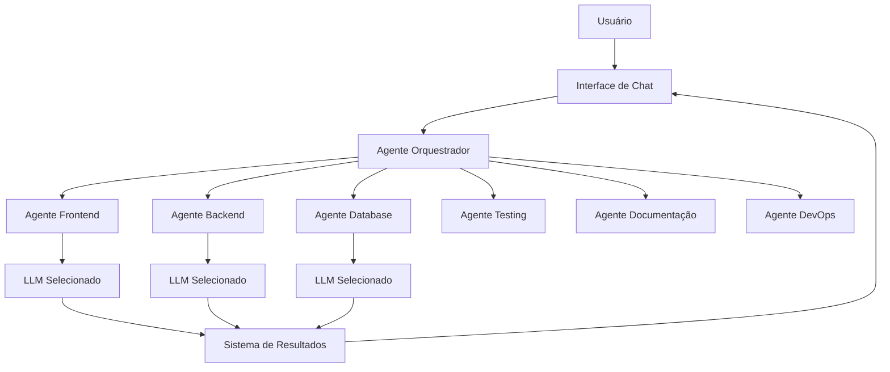

# Vibe Coding IDE - Fluxo de Usuário e Interfaces

## Fluxo Principal de Utilização

### **1. Inicialização da Aplicação**

#### Primeira Execução

1. **Tela de Boas-vindas**
   - Configuração inicial dos modelos de LLM
   - Inserção de API keys
   - Seleção de modo de operação (Econômico/Regular/Alto Desempenho)
   - Tour opcional pelas funcionalidades

#### Execuções Subsequentes

1. **Tela Principal**
   - Carregamento das configurações salvas
   - Restauração de projetos e abas abertas
   - Inicialização dos agentes

### **2. Abertura e Gerenciamento de Projetos**

#### Fluxo de Abertura

```
Usuário → Abrir Projeto → Seleção de Pasta → Análise Automática → Carregamento
```

#### Ações Automáticas na Abertura

- Detecção do tipo de projeto (React, Node.js, Python, etc.)
- Configuração automática de agentes relevantes
- Indexação de arquivos para busca
- Análise da estrutura do projeto

### **3. Interação com Sistema de Chat/Agentes**

#### Fluxo Básico

```
Usuário → Solicitação no Chat → Orquestrador → Agente Especialista → Resultado → Usuário
```

#### Fluxo com Múltiplos Agentes

```
Usuário → Solicitação → Orquestrador → Agente 1 → Agente 2 → Agente N → Resultado Final
```

#### Tipos de Interação

1. **Solicitação Simples**: Uma única resposta de um agente
2. **Pipeline Complexo**: Múltiplos agentes trabalhando em sequência
3. **Colaboração Paralela**: Múltiplos agentes trabalhando simultaneamente

## Telas e Interfaces Principais

### **1. Tela Principal (Main Layout)**

#### Layout Geral

```
┌─────────────────────────────────────────────────────────┐
│ Menu Bar                                                │
├─────────────────────────────────────────────────────────┤
│ ┌─────────┐ ┌─────────┐ ┌─────────┐ ┌─────────────────┐ │
│ │Explorer │ │ Editor  │ │Editor   │ │    AI Chat      │ │
│ │         │ │ Tab 1   │ │Tab 2    │ │                 │ │
│ │ Files   │ │         │ │         │ │ ┌─────────────┐ │ │
│ │         │ │[Code]   │ │[Code]   │ │ │   Messages  │ │ │
│ │Project  │ │         │ │         │ │ │             │ │ │
│ │Tree     │ │         │ │         │ │ │             │ │ │
│ │         │ │         │ │         │ │ │             │ │ │
│ │         │ │         │ │         │ │ └─────────────┘ │ │
│ │         │ │         │ │         │ │ ┌─────────────┐ │ │
│ │         │ │         │ │         │ │ │   Input     │ │ │
│ │         │ │         │ │         │ │ └─────────────┘ │ │
│ └─────────┘ └─────────┘ └─────────┘ └─────────────────┘ │
├─────────────────────────────────────────────────────────┤
│ Status Bar                                              │
└─────────────────────────────────────────────────────────┘
```

#### Componentes Principais

- **Explorer Panel**: Árvore de arquivos do projeto
- **Editor Tabs**: Abas de arquivos abertos
- **AI Chat Tab**: Aba dedicada para interação com agentes
- **Status Bar**: Informações do projeto e status dos agentes

### **2. Tela de Configuração de Agentes**

#### Layout da Configuração

```
┌─────────────────────────────────────────────────┐
│ Agent Configuration                             │
├─────────────────────────────────────────────────┤
│ ┌─────────────┐ ┌─────────────────────────────┐ │
│ │ Agent List  │ │ Configuration Panel         │ │
│ │             │ │                             │ │
│ │ ○ Frontend  │ │ Name: [Frontend Agent]      │ │
│ │ ● Backend   │ │                             │ │
│ │ ○ Database  │ │ System Prompt:              │ │
│ │ ○ Testing   │ │ ┌─────────────────────────┐ │ │
│ │ ○ Docs      │ │ │                         │ │ │
│ │ ○ DevOps    │ │ │ [Editable Text Area]    │ │ │
│ │             │ │ │                         │ │ │
│ │ + Add Agent │ │ │                         │ │ │
│ │             │ │ └─────────────────────────┘ │ │
│ │             │ │                             │ │
│ │             │ │ Preferred Models:           │ │
│ │             │ │ ☑ GPT-4                    │ │
│ │             │ │ ☐ Claude-3                 │ │
│ │             │ │ ☑ GPT-3.5                  │ │
│ └─────────────┘ └─────────────────────────────┘ │
└─────────────────────────────────────────────────┘
```

### **3. Tela de Configuração de LLMs**

#### Configuração de Modelos

```
┌─────────────────────────────────────────────────┐
│ LLM Configuration                               │
├─────────────────────────────────────────────────┤
│ Performance Mode: ○ Economic ● Regular ○ High  │
│                                                 │
│ Available Models:                               │
│ ┌─────────────────────────────────────────────┐ │
│ │ OpenAI                                      │ │
│ │ ☑ Enabled  API Key: [***************]      │ │
│ │ Models: GPT-4, GPT-3.5-turbo               │ │
│ │                                             │ │
│ │ Anthropic                                   │ │
│ │ ☑ Enabled  API Key: [***************]      │ │
│ │ Models: Claude-3-Opus, Claude-3-Sonnet     │ │
│ │                                             │ │
│ │ Google                                      │ │
│ │ ☐ Enabled  API Key: [_______________]      │ │
│ │ Models: Gemini-Pro, PaLM-2                 │ │
│ └─────────────────────────────────────────────┘ │
│                                                 │
│ Model Selection Strategy:                       │
│ ● Automatic (AI chooses best model)            │
│ ○ Cost Optimized                               │
│ ○ Performance Optimized                        │
│ ○ Manual Selection                             │
└─────────────────────────────────────────────────┘
```

## Fluxo de Comunicação entre Agentes

### **1. Arquitetura do Sistema de Agentes**



### **2. Fluxo Detalhado de Processamento**

#### Etapa 1: Recepção da Solicitação

```
Usuário digita solicitação → Interface valida entrada → Envia para Orquestrador
```

#### Etapa 2: Análise e Roteamento

```
Orquestrador analisa solicitação → Identifica agentes necessários → Define ordem de execução
```

#### Etapa 3: Execução dos Agentes

```
Agente recebe tarefa → Seleciona LLM adequado → Processa solicitação → Retorna resultado
```

#### Etapa 4: Agregação e Entrega

```
Resultados são coletados → Orquestrador consolida → Interface apresenta ao usuário
```

### **3. Tipos de Fluxo de Trabalho**

#### Sequential Pipeline

```
Frontend Agent → Backend Agent → Database Agent → Testing Agent
```

_Usado para desenvolvimento end-to-end_

#### Parallel Processing

```
Frontend Agent ↘
                 → Consolidator → Result
Backend Agent  ↗
```

_Usado para análises independentes_

#### Iterative Refinement

```
Initial Agent → Review Agent → Refinement Agent → Final Result
```

_Usado para melhorias incrementais_

## Estados e Feedback Visual

### **1. Estados dos Agentes**

- **Idle**: Agente disponível (indicador verde)
- **Processing**: Agente trabalhando (spinner animado)
- **Completed**: Tarefa concluída (check verde)
- **Error**: Erro na execução (indicador vermelho)

### **2. Estados do Sistema**

- **Project Loading**: Carregando projeto
- **Analyzing**: Analisando código/solicitação
- **Generating**: LLM gerando resposta
- **Consolidating**: Agregando resultados

### **3. Feedback em Tempo Real**

- Progress bars para operações longas
- Streaming de respostas dos LLMs
- Notificações de conclusão de tarefas
- Histórico de conversação persistente

## Personalização e Configuração

### **1. Configuração de Workspace**

- Preferências de layout
- Temas personalizados
- Configurações de agentes por projeto
- Templates de system prompts

### **2. Configuração Avançada**

- Rate limiting por API
- Cache de respostas
- Logs de debug
- Métricas de uso e custo

### **3. Integração com Projeto**

- Auto-detecção de tecnologias
- Configuração automática de agentes
- Sincronização com Git
- Backup de configurações
